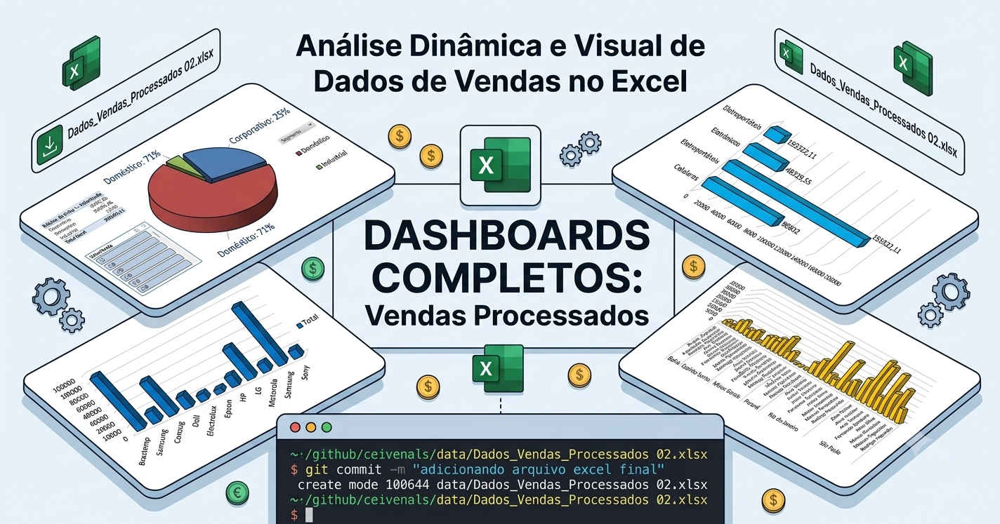

# Projeto de Análise de Vendas - DIO

Este repositório contém o desenvolvimento de um projeto prático de análise de dados, focado na transformação de dados brutos em insights estratégicos utilizando ferramentas de Business Intelligence.

## 📊 Objetivo do Projeto
O objetivo principal foi processar e modelar uma base de dados de vendas para gerar um relatório interativo, permitindo a análise de performance comercial, identificação de produtos de maior saída e avaliação de desempenho por segmentos e fabricantes.

## 🛠️ Tecnologias Utilizadas
*   **Power BI Desktop**: Ferramenta principal para modelagem, tratamento de dados (Power Query) e criação do dashboard interativo.
*   **Excel**: Utilizado para a estrutura inicial e processamento da base de dados (`Dados_Vendas_Processados 02.xlsx`).
*   **Git/GitHub**: Controle de versão para garantir a organização e o histórico do desenvolvimento.

## 📂 Estrutura dos Arquivos
*   `/data`: Contém os arquivos de origem e os dados processados.
*   `/report`: Contém o arquivo `.pbix` do projeto finalizado.
*   `/docs`: Imagens e documentação complementar.

## 🖼️ Preview do Dashboard

## 🚀 Como Visualizar
1. Faça o clone deste repositório em sua máquina local.
2. Certifique-se de ter o **Power BI Desktop** instalado.
3. Abra o arquivo localizado em `/report/Projeto_Vendas_DIO.pbix`.

---
*Projeto desenvolvido como parte da formação em análise de dados na DIO.*